<div align="center">

# ForgeFlow

**Product lifecycle management for engineered products.** Track parts, revisions and bills of materials, and route every design change through a configurable approval workflow. Every change lands in a full audit trail.


</div>

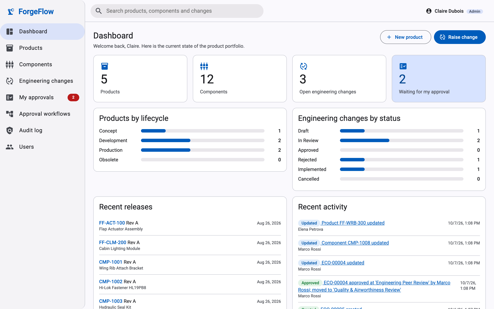

## Overview

ForgeFlow is a full-stack PLM (product lifecycle management) platform. Engineering teams use it to manage **products** and **components**, keep **revisions** and **bills of materials** under control, and move design changes through **engineering change orders (ECOs)**. An ECO has to clear an ordered chain of approvals before its new revisions are released.

The backend is a layered **ASP.NET Core 9** REST API on **Entity Framework Core 9** and **SQL Server**. The frontend is an **Angular 20** single-page app built with **Angular Material**.

## Features

- **Products and components.** A searchable catalogue with server-side filtering, sorting and paging. Each component has a *where-used* view across all product BOMs.
- **Revision control.** Revisions are lettered per ASME Y14.35 (A, B … Y, AA; the letters I, O, Q, S, X and Z are skipped) and move Draft → In review → Released → Superseded. Released revisions are read-only. A new revision starts from the BOM of the released one.
- **Bills of materials.** Each product revision has its own BOM with quantities, units, reference designators and notes. Any two revisions can be compared to see what was added, removed or changed.
- **Engineering change orders.** Collect draft revisions into an ECO and submit it for approval. Implementing the ECO releases the new revisions and supersedes the old ones in a single transaction.
- **Configurable approval workflows.** Admins define ordered steps, each with an approver role and a number of required approvals. At submission the workflow is copied onto the ECO, so editing a workflow never affects a change already in review.
- **Role-based access control.** Viewer, Engineer, Approver and Admin roles are enforced by API authorization policies and mirrored in the UI.
- **Audit logging.** The EF Core save pipeline captures every insert, update and delete with before and after values for each field. It also records business events (submissions, approvals, rejections, releases, sign-ins) and masks sensitive fields.
- **Dashboard and global search.** The dashboard shows portfolio KPIs, lifecycle and status breakdowns, recent releases and recent activity. One search box covers products, components and ECO numbers.

## Screenshots

<table>
  <tr>
    <td width="50%" valign="top">
      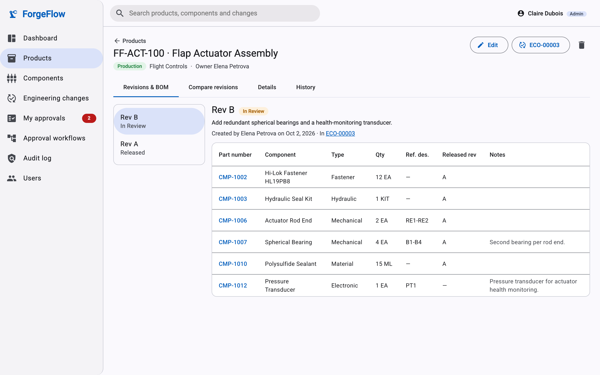
      <p align="center"><b>Revisions &amp; BOM</b>: lettered revisions with a per-revision bill of materials</p>
    </td>
    <td width="50%" valign="top">
      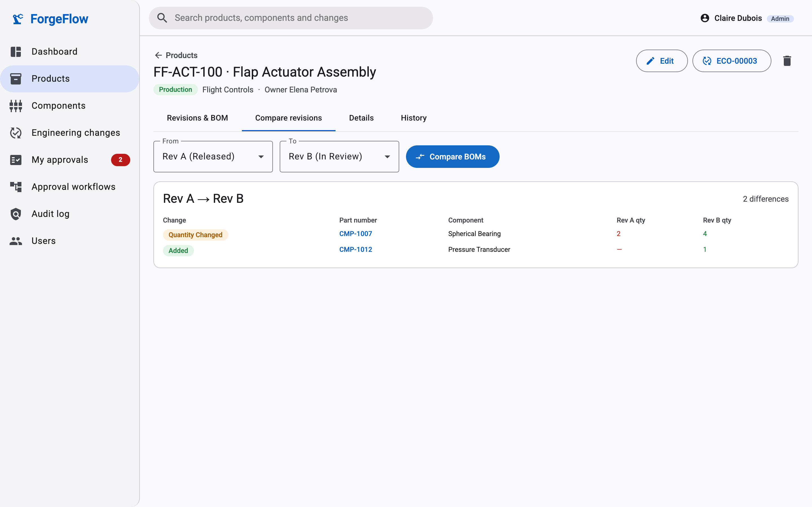
      <p align="center"><b>BOM compare</b>: what was added, removed or changed between two revisions</p>
    </td>
  </tr>
  <tr>
    <td width="50%" valign="top">
      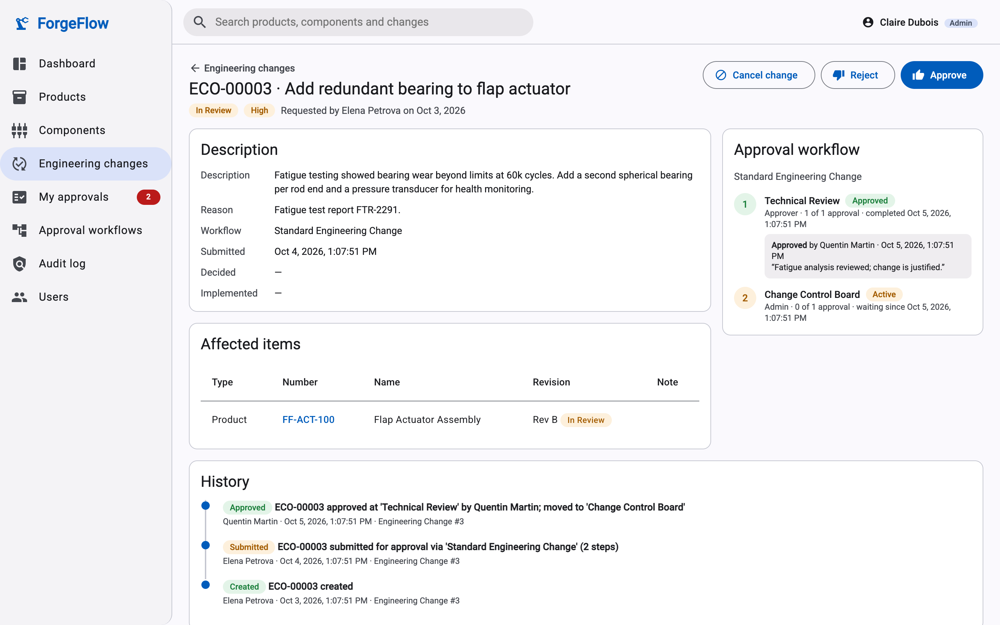
      <p align="center"><b>Engineering change</b>: affected items, approval progress and history</p>
    </td>
    <td width="50%" valign="top">
      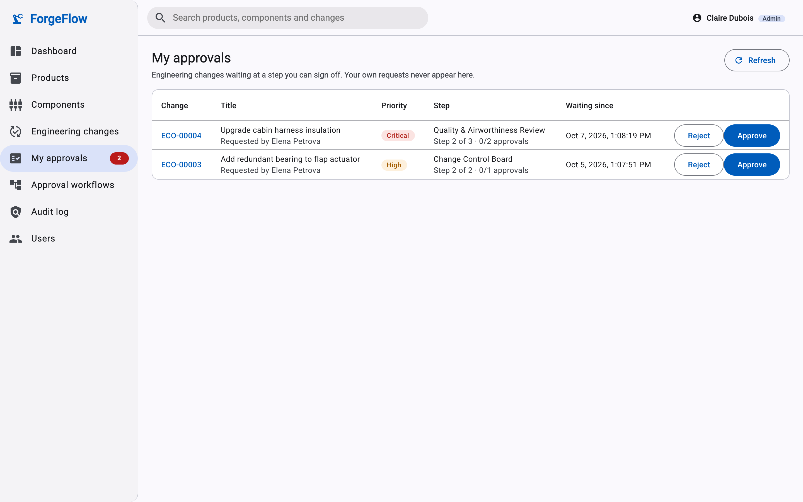
      <p align="center"><b>My approvals</b>: ECOs waiting on the signed-in user's role</p>
    </td>
  </tr>
  <tr>
    <td width="50%" valign="top">
      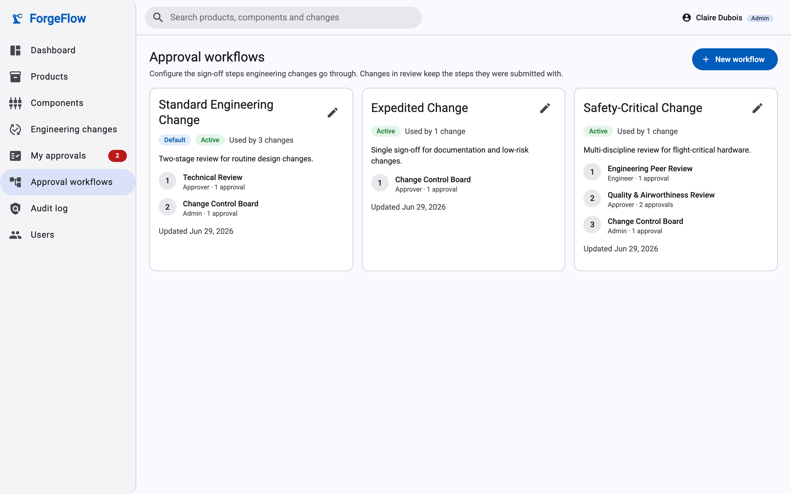
      <p align="center"><b>Approval workflows</b>: ordered steps with roles and approval counts</p>
    </td>
    <td width="50%" valign="top">
      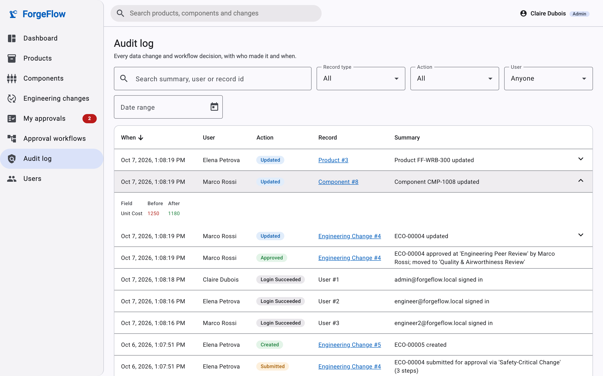
      <p align="center"><b>Audit log</b>: who changed what and when, down to the field</p>
    </td>
  </tr>
  <tr>
    <td width="50%" valign="top">
      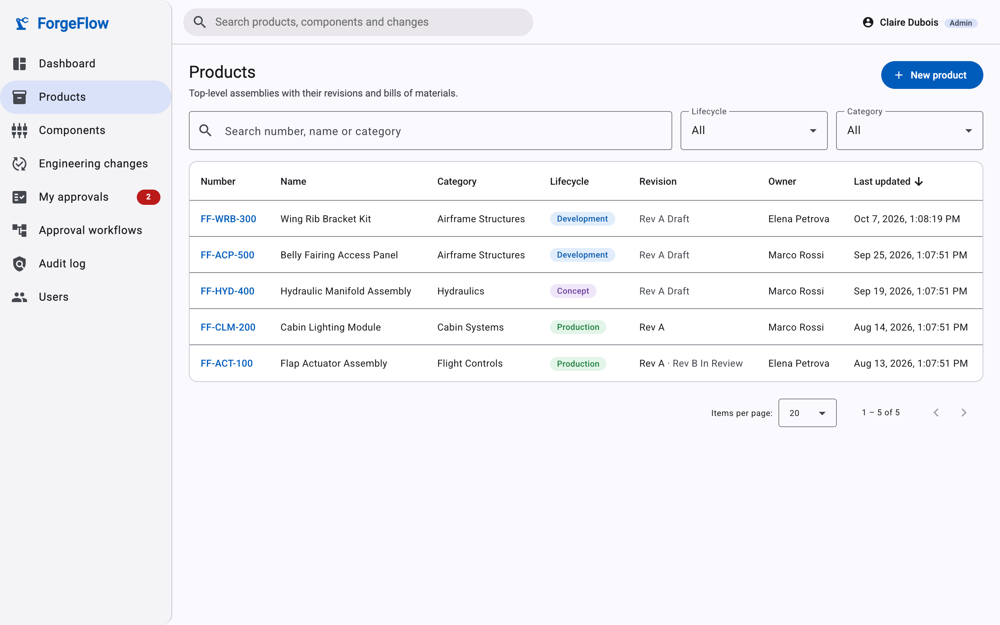
      <p align="center"><b>Products</b>: search, filter, sort and page on the server</p>
    </td>
    <td width="50%" valign="top">
      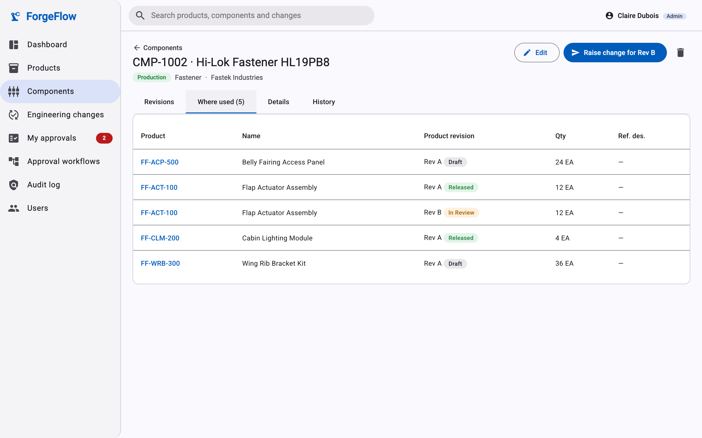
      <p align="center"><b>Where used</b>: every product revision that uses a component</p>
    </td>
  </tr>
</table>

## Architecture

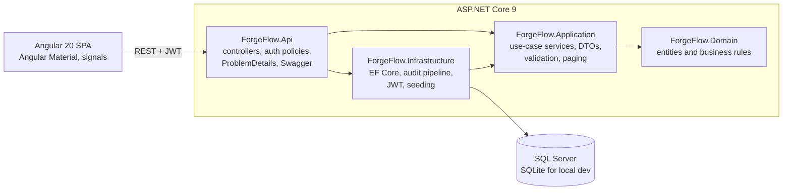

| Project | Responsibility |
| --- | --- |
| `ForgeFlow.Domain` | Entities and business rules: revision sequencing, the ECO state machine, approval decisions, BOM compare. No framework dependencies. |
| `ForgeFlow.Application` | Use-case services, DTOs, request validation, paging, sorting and search, plus the abstractions that infrastructure implements. |
| `ForgeFlow.Infrastructure` | EF Core `DbContext` and entity configurations, the audit pipeline, SQL Server migrations, JWT issuing, password hashing and demo data. |
| `ForgeFlow.Api` | REST controllers, JWT bearer authentication, authorization policies, login rate limiting, ProblemDetails errors and Swagger. |
| `web/` | Angular 20 SPA with standalone components, signals, lazy-loaded routes, route guards and an HTTP auth interceptor. |

### Engineering change lifecycle

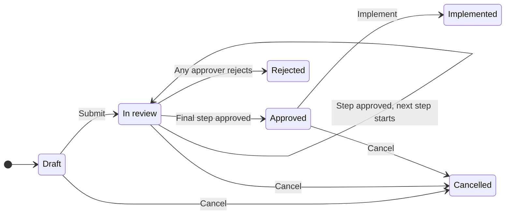

- **Submit** copies the workflow's steps onto the ECO and moves every affected revision to *In review*, which locks it for editing.
- Each step is decided by users who hold the step's role (Admins can act on any step). A step completes once it has the required number of approvals. A single rejection, which needs a comment, rejects the whole ECO.
- Requesters can't approve their own change, and each user decides at most once per step.
- **Reject** and **Cancel** return the affected revisions to *Draft*. **Implement** releases them and supersedes the previously released revisions.

### Revision lifecycle

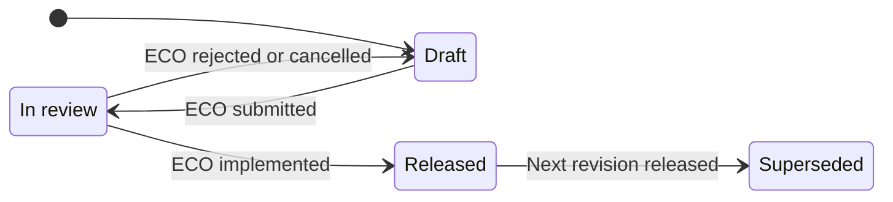

## Engineering highlights

- **Automatic audit trail.** `ForgeFlowDbContext` overrides `SaveChangesAsync`. Inside one transaction it captures the before and after values of tracked entities, saves the changes, then writes the audit rows, so inserts are logged with their generated keys and the audit can't drift from the data. Child records (revisions, BOM lines, ECO affected items, workflow steps) roll up into their parent's history.
- **Rich domain model.** The rules live in the domain rather than in controllers: ECO transitions, approval blockers, revision letter sequencing and BOM diffs. The services orchestrate those rules and persist the results.
- **Workflow snapshotting.** Approval steps are copied onto the ECO at submission, so the approval history stays accurate after a workflow is edited.
- **Optimistic concurrency.** ECOs carry a concurrency token. If two approvers act at the same moment, the second gets `409 Conflict` instead of silently overwriting the first.
- **Consistent errors.** All failures are returned as RFC 7807 `ProblemDetails`: validation errors per field (400), forbidden actions (403), missing records (404), and business rule or concurrency conflicts (409).
- **Secure by default.** Every endpoint requires authentication through a fallback authorization policy. The API uses role-based policies, rate-limited sign-in, ASP.NET Core Identity password hashing, expiring JWTs, and a CORS allow-list from configuration. The production signing key and connection string come from user secrets or environment variables. The only key checked in is a development-only one.
- **Two database providers.** SQL Server is the production target, with EF Core migrations and an idempotent SQL script. Local development runs on SQLite with no setup.
- **Testable layers.** Domain and service tests run against in-memory SQLite. API tests use `WebApplicationFactory` to cover authentication, authorization, the full ECO workflow and the audit log over HTTP.

## Roles and permissions

| Capability | Viewer | Engineer | Approver | Admin |
| --- | :---: | :---: | :---: | :---: |
| Browse products, components, ECOs, dashboard and search | ✓ | ✓ | ✓ | ✓ |
| Create and edit products, components, revisions and BOMs | | ✓ | | ✓ |
| Raise, submit, implement and cancel ECOs | | ✓ | | ✓ |
| Approve or reject ECO steps (the step's role must match) | | ✓ | ✓ | ✓ |
| View the audit log | | | ✓ | ✓ |
| Manage approval workflows and users, delete records | | | | ✓ |

## API overview

All routes are under `/api` and need a bearer token from `POST /api/auth/login`. In Development, Swagger UI is served at `http://localhost:5080/swagger`.

| Area | Endpoints |
| --- | --- |
| Auth | `POST auth/login` · `GET auth/me` |
| Products | `GET, POST products` · `GET, PUT, DELETE products/{id}` · `GET products/categories` · `GET products/{id}/history` |
| Product revisions | `GET, POST products/{id}/revisions` · `GET, PUT products/{id}/revisions/{revisionId}` · `GET products/{id}/revisions/compare` |
| Bill of materials | `POST products/{id}/revisions/{revisionId}/bom` · `PUT, DELETE products/{id}/revisions/{revisionId}/bom/{bomItemId}` |
| Components | `GET, POST components` · `GET, PUT, DELETE components/{id}` · `POST components/{id}/revisions` · `PUT components/{id}/revisions/{revisionId}` · `GET components/{id}/where-used` · `GET components/{id}/history` |
| Engineering changes | `GET, POST changes` · `GET, PUT changes/{id}` · `POST changes/{id}/affected-items` · `DELETE changes/{id}/affected-items/{affectedItemId}` · `POST changes/{id}/submit` · `POST changes/{id}/approve` · `POST changes/{id}/reject` · `POST changes/{id}/implement` · `POST changes/{id}/cancel` · `GET changes/{id}/history` |
| Approvals | `GET approvals/pending` |
| Workflows | `GET, POST workflows` · `GET, PUT workflows/{id}` |
| Audit, users and more | `GET audit-logs` · `GET, POST users` · `PUT users/{id}` · `GET users/directory` · `GET dashboard` · `GET search` |

## Getting started

**Prerequisites:** [.NET SDK 9](https://dotnet.microsoft.com/download/dotnet/9.0) and [Node.js 22](https://nodejs.org/).

```bash
git clone https://github.com/harshitbansal0/forgeflow.git
cd forgeflow

# 1. API on http://localhost:5080
dotnet run --project src/ForgeFlow.Api

# 2. Web app on http://localhost:4200 (in a second terminal)
cd web
npm install
npm start
```

In Development the API creates a local SQLite database (`src/ForgeFlow.Api/forgeflow.db`) and seeds an aerospace-themed demo: 6 users, 5 products, 12 components, 3 approval workflows, and 5 ECOs in different states. The Angular dev server proxies `/api` to the API. To reset the demo, stop the API and delete `forgeflow.db`.

### Demo accounts

Every demo account uses the password `ForgeFlow!2026`. On the sign-in page you can also click an account to fill in the form.

| Email | Name | Role |
| --- | --- | --- |
| `admin@forgeflow.local` | Claire Dubois | Admin |
| `engineer@forgeflow.local` | Elena Petrova | Engineer |
| `engineer2@forgeflow.local` | Marco Rossi | Engineer |
| `approver@forgeflow.local` | Quentin Martin | Approver |
| `approver2@forgeflow.local` | Hannah Schmidt | Approver |
| `viewer@forgeflow.local` | Victor Lee | Viewer |

<p align="center">
  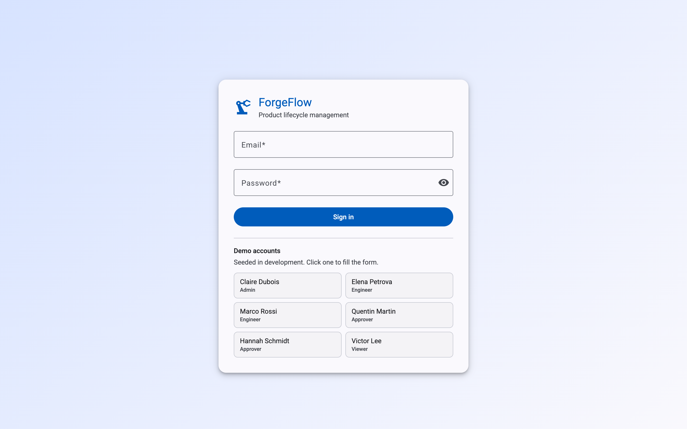
</p>

### Using SQL Server

SQL Server is the production database. The API applies the EF Core migrations at startup. Demo data is only seeded when `Seeding:DemoData` is `true`.

```bash
cd src/ForgeFlow.Api
dotnet user-secrets set "Database:Provider" "SqlServer"
dotnet user-secrets set "ConnectionStrings:SqlServer" "Server=localhost,1433;Database=ForgeFlow;User Id=<user>;Password=<password>;TrustServerCertificate=True"
dotnet user-secrets set "Jwt:SigningKey" "<random string, at least 32 characters>"
```

[`database/ForgeFlow.SqlServer.sql`](database/ForgeFlow.SqlServer.sql) is an idempotent script of the full schema, for DBAs who prefer to apply it by hand. After a model change, regenerate it:

```bash
dotnet tool restore
dotnet dotnet-ef migrations add <Name> --project src/ForgeFlow.Infrastructure --startup-project src/ForgeFlow.Api --output-dir Persistence/Migrations
dotnet dotnet-ef migrations script --idempotent --project src/ForgeFlow.Infrastructure --startup-project src/ForgeFlow.Api --output database/ForgeFlow.SqlServer.sql
```

### Configuration

| Setting | Purpose | Development value |
| --- | --- | --- |
| `Database:Provider` | `SqlServer` or `Sqlite` | `Sqlite` |
| `ConnectionStrings:SqlServer` / `ConnectionStrings:Sqlite` | Database connection | `Data Source=forgeflow.db` |
| `Jwt:SigningKey`, `Jwt:Issuer`, `Jwt:Audience`, `Jwt:ExpiryMinutes` | Token signing and lifetime | Dev-only key, 120 minutes |
| `Seeding:DemoData` | Seed demo users and data into an empty database | `true` |
| `Cors:AllowedOrigins` | Browser origins allowed to call the API | `http://localhost:4200` |
| `RateLimiting:LoginPermitLimit` | Sign-in attempts per IP address per minute | `10` |

## Tests

```bash
dotnet test
```

| Project | Covers |
| --- | --- |
| `tests/ForgeFlow.UnitTests` | Revision letter sequencing, ECO state machine and approval rules, BOM compare, product service behaviour, and the audit pipeline (in-memory SQLite) |
| `tests/ForgeFlow.ApiTests` | Authentication, role-based authorization, product endpoints, the end-to-end ECO approval workflow, and the audit log over HTTP (`WebApplicationFactory`) |

## Project structure

```
forgeflow/
├── src/
│   ├── ForgeFlow.Domain/          # Entities, enums and business rules
│   ├── ForgeFlow.Application/     # Services, DTOs, validation, paging
│   ├── ForgeFlow.Infrastructure/  # EF Core, migrations, audit pipeline, identity, seeding
│   └── ForgeFlow.Api/             # Controllers, auth, error handling, Program.cs
├── tests/
│   ├── ForgeFlow.UnitTests/
│   └── ForgeFlow.ApiTests/
├── web/                           # Angular 20 + Angular Material SPA
│   └── src/app/
│       ├── core/                  # API clients, auth, models, interceptors
│       ├── shared/                # Reusable components, dialogs, pipes
│       ├── layout/                # App shell and navigation
│       └── features/              # Dashboard, products, components, changes, approvals, workflows, audit, users
├── database/                      # Generated SQL Server schema script
└── docs/screenshots/
```
